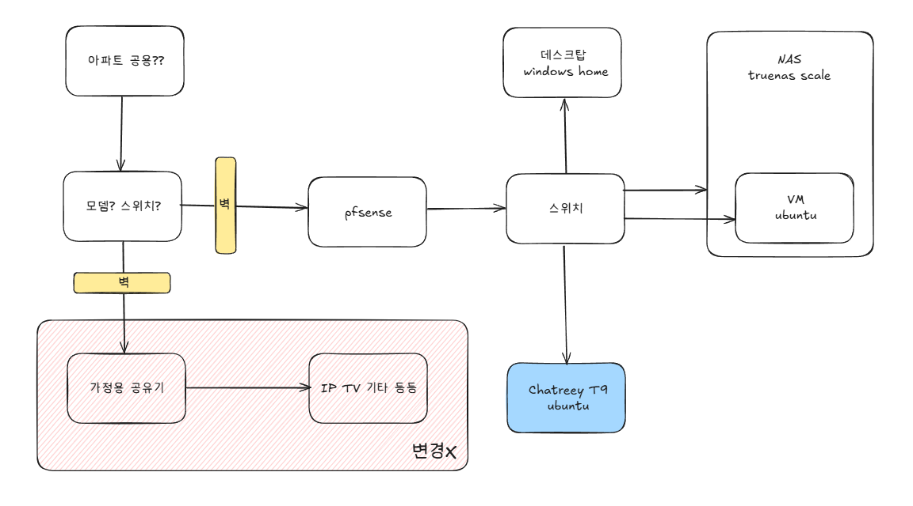
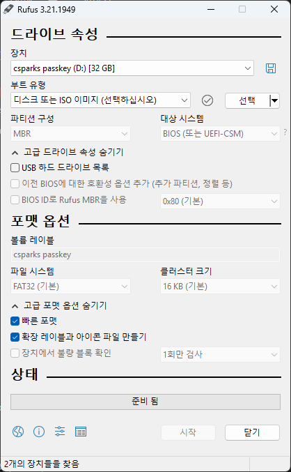
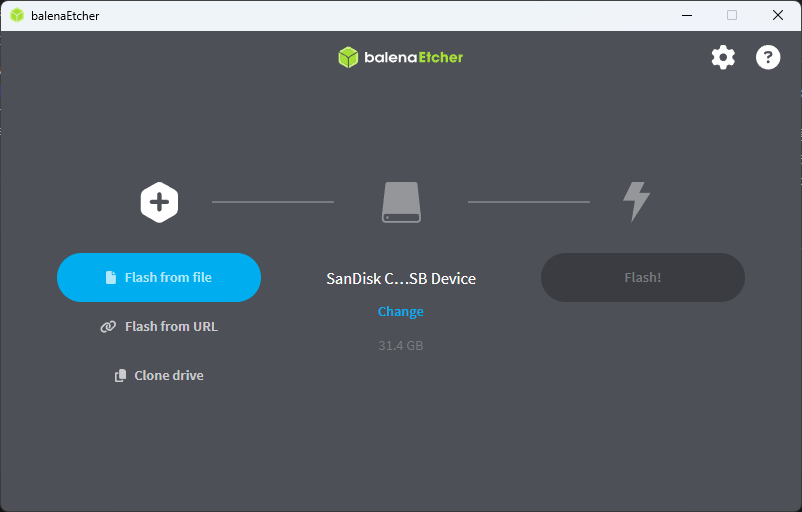

# 홈랩 스터디 1주차

## 실습할 내용

1. ✅ Boot Media 만들기
2. ✅ OS가 이미 설치되어 있는 장치 / 설치 되어 있지 않은 장치에 우분투 설치하기
3. ✅ 환경 공유하기
    

    
방 토폴로지

    

    

    
    

    

    

## 새롭게 배운 것

### Ubuntu 설치의 정석 [[참고]](https://ubuntu.com/tutorials/install-ubuntu-desktop#1-overview)

- 기존에는 rufus를 사용해서 boot media를 만들었었는데, 공식 홈페이지에서는 Windows, macOS, Linux를 모두 지원하는 [balenaEtcher](https://etcher.balena.io/)의 사용을 권고하고 있음 (rufus는 Windows만 지원)
- rufus와 비교했을 때 balenaEthcher의 사용성이 더 좋아보임

rufus UI

  

~~솔직히 처음 봤을 때 정신이 아득해졌다~~

balenaEtcher UI

  

### Ventoy [링크](https://www.ventoy.net/en/index.html)
- Ventoy를 사용하면 하나의 boot media에 여러 os image를 담아 설치할 때 선택할 수 있음
- MBR과 GPT 방식 모두 지원하는 특징이 있음

### USB3가 준비물이었던 이유
- 데이터 전송 속도가 빠르기 때문에 OS 부팅 시간이 단축됨
- 호환성 및 안정성이 좋아 최신 PC 대부분에서 인식 잘 됨
    - usb2 소켓에 usb3를 꽂으면 작동하지만 usb3 소켓에 usb2를 꽂으면..
- 대용량 OS 이미지도 빠르게 플래싱하고 읽을 수 있음, 설치 시간 절약 가능

## 해결한 문제

### bios에는 진입했으나 ubuntu 설치 화면으로 넘어가지 않음
